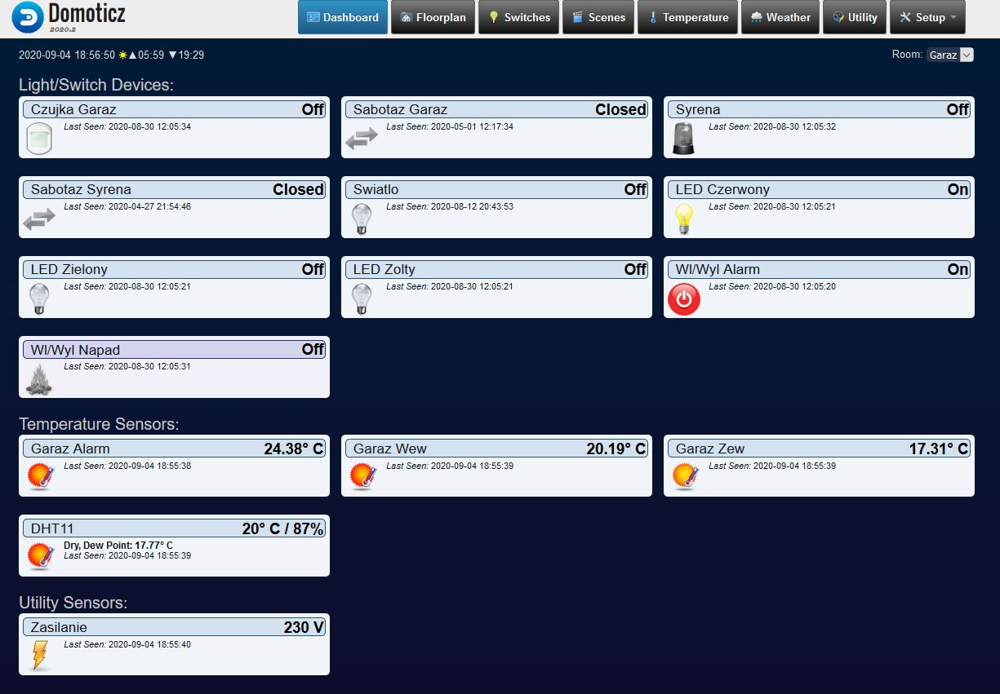
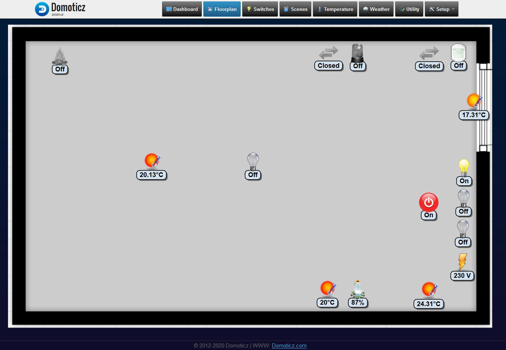
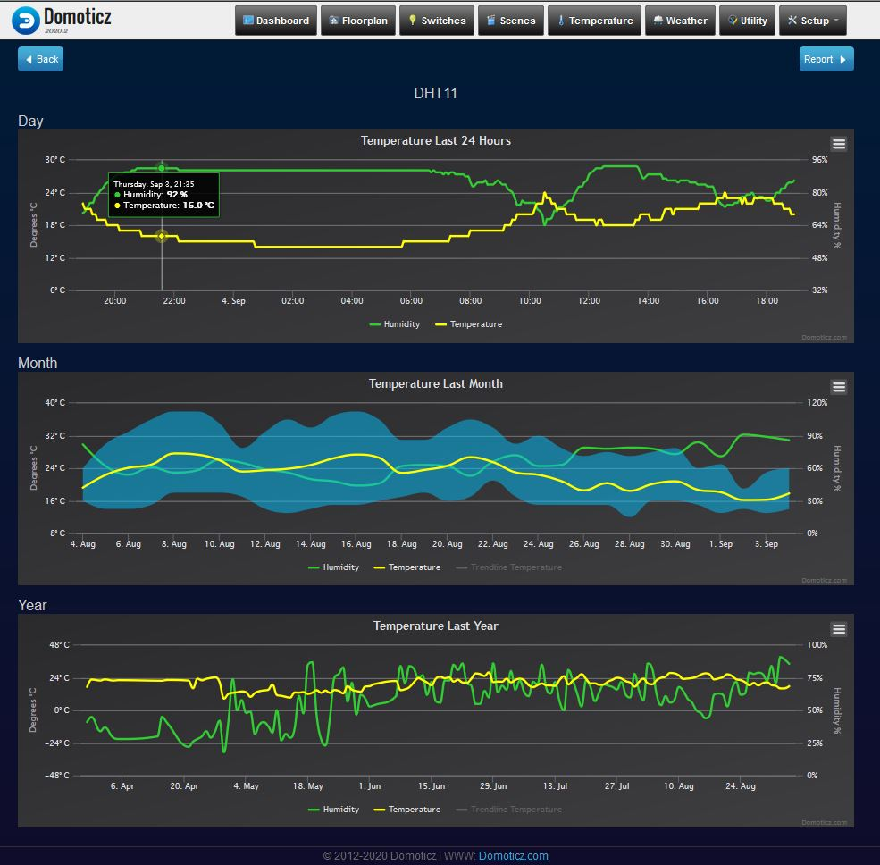

# DomoticzHttp
An example alarm demo based on Arduino and Domoticz. Json API and the HTTP protocol are used to communicate with the Domoticz platform. Communication between the card and the server is full-duplex. In order to update the server data, the card uses the pooling method every period defined by the user.
## Used
* Arduino Uno Rev3
* Arduino Ethernet Shield 2
* 3 x DS18B20
* DHT11
## Screens
* System summary 

* Floorplan

* DHT11 log

